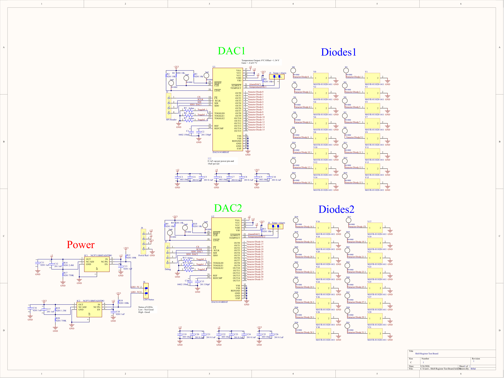

# DAC Test Board

Test board designed to independently control and evaluate 32 varactor diode channels using two 16-channel DACs.

## PCB

## Features

- Two 16-channel DAC sections for 32 independently controlled outputs
- 32 varactor diode connections
- Individual test points for each output channel
- SPI control interface
- Dedicated debug header
- Temperature alarm monitoring for both DACs
- Configurable toggle control inputs
- 3.3 V, 5 V, and 12 V power rails
- Low noise LDO 

## Design

The board is divided into two independent 16-channel DAC sections. Each DAC provides individual analog outputs for controlling 16 varactor diodes, giving the complete board 32 controllable channels.

Test points are provided for each varactor diode output to allow direct voltage measurement during testing. SPI headers provide access to the DAC control interface, while additional debug connections expose the clock, data, and chip-select signals.

The board also includes dedicated power regulation, temperature alarm outputs, LDO status monitoring, and configurable control inputs to support system-level testing and debugging.

## Schematic

